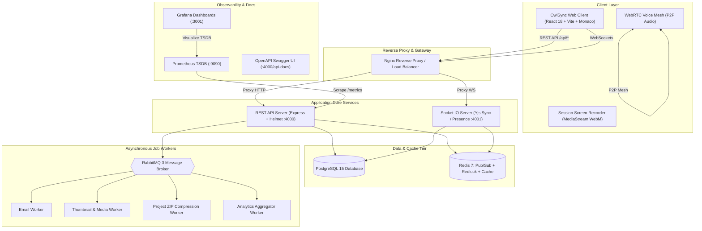

# OwlSync 🦉
> **The Real-Time Developer Collaboration & Cloud Workspace Platform**  
> *Code, communicate, build, and execute together in synchronized real-time workspaces.*

---

[](https://vitejs.dev/)
[](https://jestjs.io/)
[](https://nodejs.org/)
[](https://www.postgresql.org/)
[](https://redis.io/)
[](https://www.rabbitmq.com/)
[](https://www.docker.com/)

---

## 🌟 Executive Vision & Why OwlSync Exists

Most portfolio projects are either basic single-user CRUD apps or simple coding interview clones (LeetCode / CoderPad). **OwlSync** is engineered as a true production-grade SaaS product that bridges the gap between:
- **Cloud IDEs** (VS Code Live Share, Replit, Cursor)
- **Real-Time Canvas & Notes** (Google Docs, Excalidraw, Notion)
- **Developer Communication** (Discord voice rooms, live cursor presence)
- **Asynchronous Scalability** (RabbitMQ background workers, Redis Pub/Sub, Prometheus/Grafana observability)

---

## 🏗 High-Level Architecture & System Design

OwlSync is architected as a **Modular Monorepo** separating client-side reactivity, RESTful business domains, real-time WebSocket state distribution, and asynchronous worker queues:



---

## 🚀 Core Feature Highlights

| Module | Features & Capabilities |
|:---|:---|
| **💻 Collaborative Monaco IDE** | Multi-file tabs, live cursor tracking with name tags, Yjs CRDT conflict-free synchronization, and file tree management. |
| **🎙 WebRTC Voice Mesh** | Low-latency P2P mesh audio rooms with speaking indicators, mute controls, and signaling relays. |
| **📹 Session Screen Recorder** | In-browser screen + microphone audio recording engine with webm rendering and server upload pipelines. |
| **🤖 AI Pair Programmer** | Context-aware code explanations, refactoring engine, automated unit test generation, bug detection, and live SSE streaming agent. |
| **⚡ POSIX Virtual Terminal** | In-browser interactive command-line interface with built-in commands (`help`, `ls`, `cat`, `node`, `run`, `clear`, `whoami`, `date`). |
| **👥 Teams & Organizations** | Multi-tenant team switcher, member roster with role badges (`OWNER`, `ADMIN`, `MEMBER`), and shared team repositories. |
| **🛡 Room Role Permissions** | Host promotion/demotion (`OWNER`, `MEMBER`, `GUEST/VIEWER`), read-only editor locks for viewers, and instant kick guards. |
| **📦 Codebase Import & Export** | WebKit Directory import, ZIP archive extractor, and asynchronous one-click project `.zip` export downloads. |
| **🔍 Global Search Engine** | Real-time cross-platform search across rooms, projects, files, and users with keyboard shortcuts. |
| **🔔 Notification Center** | Real-time alerts for 1-click room invites, friend requests, and system announcements. |
| **🏆 Gamification & Badges** | Automated badge awarding engine and rich profile achievement showcase. |
| **📊 Observability & Metrics** | Prometheus metrics exposition, Grafana dashboard visualization, and Redlock distributed locking. |

---

## 📂 Monorepo Structure

```
owlsync/
├── apps/
│   ├── api/             # REST API server (Express, Prisma, Helmet, Swagger, Redlock)
│   ├── socket/          # Real-time WebSocket server (Socket.IO, Yjs, WebRTC signaling)
│   ├── web/             # Frontend application (React 18, Vite, Tailwind CSS, Monaco)
│   └── workers/         # RabbitMQ background worker consumers (Email, Media, Analytics)
├── packages/
│   └── database/        # Prisma ORM schema, client generation, migrations & seeds
├── infrastructure/
│   ├── prometheus/      # Prometheus scrape configs and rules
│   └── grafana/         # Provisioned Grafana datasources and dashboards
├── docs/                # Comprehensive Software Design Document (SDD) & API Specs
│   ├── SDD.md           # Master Software Design Document
│   ├── architecture/    # System design & WebSocket event directory
│   ├── database/        # Relational schema specifications & ER diagrams
│   ├── api/             # REST API endpoints reference
│   └── workers/         # RabbitMQ queues & worker architecture
├── storage/             # Local and self-hosted storage directories (recordings, thumbnails)
└── docker-compose.yml   # Multi-container orchestration (Postgres, Redis, RabbitMQ, Monitoring)
```

---

## 🛠 Quick Start & Local Setup

### 1. Prerequisites
- **Node.js** v20+
- **Docker Desktop** & Docker Compose

### 2. Clone and Start Infrastructure
```bash
# Clone the repository
git clone https://github.com/DhruvGola777/OwlSync.git
cd OwlSync

# Start PostgreSQL, Redis, RabbitMQ, Prometheus, and Grafana
docker compose up -d
```

### 3. Install Dependencies & Migrate Database
```bash
# Install all monorepo dependencies
npm install

# Push database schema & generate Prisma client
npm run db:push
npm run db:generate
```

### 4. Run All Services in Development
```bash
npm run dev
```

The services will be available at:
- **Web Client**: `http://localhost:3000`
- **REST API Server**: `http://localhost:4000`
- **Interactive Swagger Docs**: `http://localhost:4000/api-docs`
- **Socket Server**: `http://localhost:4001`
- **RabbitMQ Management Dashboard**: `http://localhost:15672` (User/Pass: `guest` / `guest`)
- **Prometheus Metrics**: `http://localhost:9090`
- **Grafana Monitoring**: `http://localhost:3001` (User/Pass: `admin` / `admin`)

---

## 📚 Detailed Documentation

For in-depth architecture diagrams, sequence flows, database models, and API specifications, explore the **[docs/](./docs)** directory:
- 📖 **[Master Software Design Document (SDD)](./docs/SDD.md)**
- 📐 **[System Architecture & Subsystems](./docs/architecture/system-design.md)**
- 🔌 **[WebSocket Events & Real-time Payloads](./docs/architecture/websocket-events.md)**
- 🗄 **[Database Schema & ER Diagrams](./docs/database/schema.md)**
- 🌐 **[REST API Reference Guide](./docs/api/rest-api.md)**
- ⚙️ **[RabbitMQ Workers & Job Queues](./docs/workers/rabbitmq-workers.md)**

---

## 🧪 Testing & Verification

Run the automated backend test suites:
```bash
npm --prefix apps/api test
```

Run the frontend production build validation:
```bash
npm --prefix apps/web run build
```

---

## 📄 License
Licensed under the [MIT License](./LICENSE).
