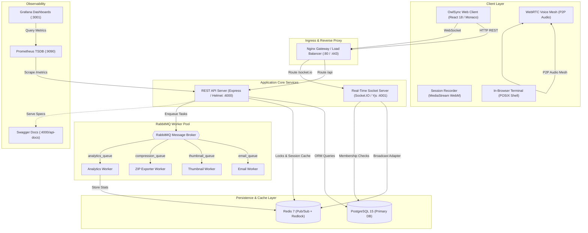
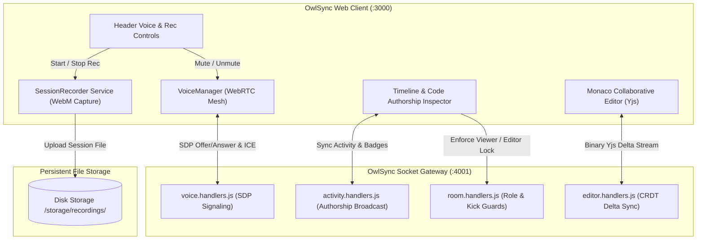

<div align="center">

# 🦉 OwlSync
### Enterprise Real-Time Cloud IDE & Collaborative Workspace Platform

**A distributed, low-latency development environment combining the power of VS Code, Discord, and Google Docs.**

[](https://vitejs.dev/)
[](https://jestjs.io/)
[](https://nodejs.org/)
[](https://www.typescriptlang.org/)
[](https://www.postgresql.org/)
[](https://redis.io/)
[](https://www.rabbitmq.com/)
[](https://www.docker.com/)

<p align="center">
  <a href="#-system-architecture">Architecture</a> •
  <a href="#-core-feature-matrix">Features</a> •
  <a href="#-monorepo-topology">Folder Structure</a> •
  <a href="#-getting-started-locally">Quick Start</a> •
  <a href="#-enterprise-documentation-portal">Documentation (SDD)</a> •
  <a href="#-security--distributed-reliability">Security & Redlock</a>
</p>

---

</div>

## 📌 Executive Overview

Modern remote software teams are fragmented across disconnected tools: editors (**VS Code / Replit**), meeting channels (**Discord / Google Meet**), project wikis (**Notion / Google Docs**), and AI copilots (**Cursor / ChatGPT**).

**OwlSync** solves this fragmentation by converging full-stack cloud editing, conflict-free document replication (CRDTs), peer-to-peer WebRTC voice mesh, background asynchronous job queues, and AI pair programming into a single, unified, production-grade SaaS platform.

### Key Engineering Tenets
- **Sub-10ms Input Latency**: Monaco editor backed by **Yjs CRDTs** and **Redis Pub/Sub** eliminates write locks and prevents race conditions.
- **Asynchronous Task Offloading**: Heavy background tasks (media transcoding, ZIP compilation, email dispatch, analytics rollups) run out-of-band via **RabbitMQ** worker queues.
- **Distributed Concurrency Control**: Enterprise **Redlock algorithm** with atomic Lua release scripts protects critical database state across horizontal API nodes.
- **Full-Stack Observability**: Built-in **Prometheus** metrics exporter and **Grafana** visualization for real-time throughput, active socket connections, and event latency.

---

## 🏛 System Architecture

OwlSync follows a decoupled **Modular Monorepo Architecture**, separating the frontend reactivity layer, REST microservices, real-time WebSocket cluster, asynchronous job pipelines, and persistence storage.



---

## 🎯 Detailed Subsystem & Media Flowchart

The following diagram illustrates the real-time interaction between client-side voice/recording components and the server-side signaling and activity handlers:



---

## ⚡ Core Feature Matrix

| Category | Enterprise Capability | Technical Implementation |
|:---|:---|:---|
| **Editor & Sync** | **Zero-Conflict Collaborative Code Editing** | Monaco Editor integrated with **Yjs CRDTs** over WebSockets; custom cursor presence renderer with dynamic author color-tagging. |
| **Media & Comms** | **P2P Voice Mesh & Audio Rooms** | Ultra-low latency WebRTC audio mesh with speaking indicators, local mute, and Socket.IO signaling relay. |
| **Media Engine** | **In-IDE Screen & Audio Session Recorder** | Captures canvas and audio streams directly into standard `.webm` archives with asynchronous background thumbnail rendering. |
| **AI Intelligence** | **Context-Aware AI Pair Programmer** | Automated code explanations, refactoring, test generation, bug detection, and **Server-Sent Events (SSE)** streaming pair programmer. |
| **Execution** | **Virtual POSIX Command-Line Terminal** | In-browser command line supporting script execution (`node`, `python`), virtual filesystem navigation (`ls`, `cat`), and pipeline helpers. |
| **Organizations** | **Multi-Tenant Teams & Workspaces** | Granular role-based workspaces (`OWNER`, `ADMIN`, `MEMBER`), team-scoped project repositories, and member roster management. |
| **Security & RBAC** | **Granular Room Access Control** | Dynamic promotion/demotion to `VIEWER` (read-only Monaco editor locking) with socket-level drop guards preventing unauthorized state changes. |
| **Ingress/Egress** | **Project Importer & ZIP Bundler** | WebKit Directory browser folder import, ZIP archive extractor, and background `.zip` exporter worker. |
| **Search Engine** | **Global Multi-Entity Search** | Instant full-text search spanning rooms, projects, file trees, and users with keyboard shortcuts (`Cmd+K` / `Ctrl+K`). |
| **Notifications** | **Real-Time Notification Ledger** | PostgreSQL notifications system with 1-click room invites, friend request actions, and badge alert popups. |
| **Gamification** | **Developer Achievements & Badges** | Automated badge-awarding engine and visual profile showcase (`Early Adopter`, `Master Collaborator`, `Night Owl`). |
| **Observability** | **Enterprise Metrics & Monitoring** | Custom Prometheus metrics endpoint (`/metrics`), live Grafana dashboard provisioning, and Swagger UI OpenAPI interactive docs. |

---

## 📂 Monorepo Topology

OwlSync is organized as a clean Turborepo monorepo with strict domain encapsulation:

```
owlsync/
├── apps/
│   ├── api/                     # REST API Microservice (Express, Prisma, Helmet, Redlock)
│   │   ├── src/modules/         # Domain Modules: auth, users, projects, teams, badges, ai, search
│   │   ├── src/services/        # Distributed lock, cache, and metrics services
│   │   └── tests/               # Jest automated integration & security test suites
│   ├── socket/                  # Real-Time WebSocket Microservice (Socket.IO, Yjs, WebRTC)
│   │   └── src/handlers/        # Handlers: editor, voice, room, activity, chat
│   ├── web/                     # Single Page Application (React 18, Vite, Tailwind CSS, Monaco)
│   │   ├── src/features/        # Domain UI: rooms, projects, teams, recordings, users, auth
│   │   └── src/components/      # UI Design System: layout, modals, terminal, voice controls
│   └── workers/                 # Asynchronous RabbitMQ Consumers
│       └── src/consumers/       # Workers: email, thumbnail, compression, analytics
├── packages/
│   └── database/                # Centralized Prisma ORM schema, migrations, client generation
├── infrastructure/
│   ├── prometheus/              # Prometheus scrapers, recording rules, alert triggers
│   └── grafana/                 # Pre-configured Grafana telemetry dashboards
├── docs/                        # Enterprise Software Design Document (SDD) & Reference Portal
│   ├── SDD.md                   # Complete Master Software Design Document
│   ├── architecture/            # System topology, flow diagrams & WebSocket event catalog
│   ├── database/                # Relational ER schema & constraint specifications
│   ├── api/                     # REST API reference guide & Swagger schema
│   └── workers/                 # RabbitMQ worker architecture & message payloads
├── storage/                     # Local persistent storage volumes (recordings, thumbnails, exports)
└── docker-compose.yml           # Multi-container orchestration (Postgres, Redis, RabbitMQ, Prometheus, Grafana)
```

---

## 🚀 Getting Started Locally

### Prerequisites
- **Node.js** v20.x or higher
- **Docker Desktop** (with Docker Compose)
- **Git**

### Step 1: Clone Repository & Start Infrastructure
```bash
git clone https://github.com/DhruvGola777/OwlSync.git
cd OwlSync

# Start PostgreSQL (5432), Redis (6379), RabbitMQ (5672/15672), Prometheus (9090), Grafana (3001)
docker compose up -d
```

### Step 2: Install Dependencies & Synchronize Database
```bash
# Install all workspace dependencies
npm install

# Push relational schema to PostgreSQL & generate Prisma Client
npm run db:push
npm run db:generate
```

### Step 3: Run Full Development Environment
```bash
npm run dev
```

### 🌐 Service Endpoints Directory

| Service | Port / URL | Description | Credentials (if applicable) |
|:---|:---|:---|:---|
| **Web Client** | `http://localhost:3000` | Main Cloud IDE & Workspace Dashboard | — |
| **REST API Server** | `http://localhost:4000` | Core Application Backend | — |
| **Swagger OpenAPI Docs** | `http://localhost:4000/api-docs` | Interactive Swagger API Documentation | — |
| **Real-Time Socket Server** | `http://localhost:4001` | Socket.IO WebSocket Engine | — |
| **RabbitMQ Management** | `http://localhost:15672` | Message Broker Queue Dashboard | User: `guest` / Pass: `guest` |
| **Prometheus TSDB** | `http://localhost:9090` | Time-Series Metrics Scraper | — |
| **Grafana Monitoring** | `http://localhost:3001` | Infrastructure & App Telemetry | User: `admin` / Pass: `admin` |

---

## 🔒 Security & Distributed Reliability

1. **Distributed Redlock Concurrency**:
   Critical state mutations (room creation, room joining, collaborative workspace claiming) are synchronized via Redis `SET NX PX` distributed locks with atomic Lua release scripts:
   ```javascript
   // Safe atomic lock release with Lua validation
   const luaScript = `
     if redis.call("get", KEYS[1]) == ARGV[1] then
       return redis.call("del", KEYS[1])
     else
       return 0
     end
   `;
   ```
2. **Session Security & Refresh Token Rotation**:
   Secure HTTP-only encrypted cookies paired with cryptographically signed JWT access tokens and database-tracked refresh token rotation.
3. **Hardened Defense**:
   Full HTTP security header enforcement via **Helmet**, strict CORS whitelisting, input validation via **Zod**, and Markdown XSS sanitization.

---

## 📖 Enterprise Documentation Portal

Comprehensive architectural specifications, flow sequence diagrams, and protocol catalogs are documented in the **[`docs/`](./docs)** portal:

- 📑 **[Master Software Design Document (SDD.md)](./docs/SDD.md)** — Complete Tier-1 technical engineering document.
- 📐 **[System Architecture & Flow Diagrams](./docs/architecture/system-design.md)** — Subsystem boundaries and signaling flows.
- 🔌 **[WebSocket Event Catalog & Payloads](./docs/architecture/websocket-events.md)** — Complete WebSocket event catalog.
- 🗄 **[Database Schema & ER Models](./docs/database/schema.md)** — Relational tables, foreign keys, and indexes.
- 🌐 **[REST API Specifications](./docs/api/rest-api.md)** — Request/response schemas & authentication guidelines.
- ⚙️ **[RabbitMQ Background Workers](./docs/workers/rabbitmq-workers.md)** — Message queues, event payloads, and retries.

---

## 🧪 Test Suite & Continuous Integration

Run the comprehensive integration test suite:
```bash
# Run automated API, Auth, Security, and Distributed Lock tests
npm --prefix apps/api test
```

Run the production client build validation:
```bash
npm --prefix apps/web run build
```

---

## 📄 License
This project is open-source and licensed under the **[MIT License](./LICENSE)**.
