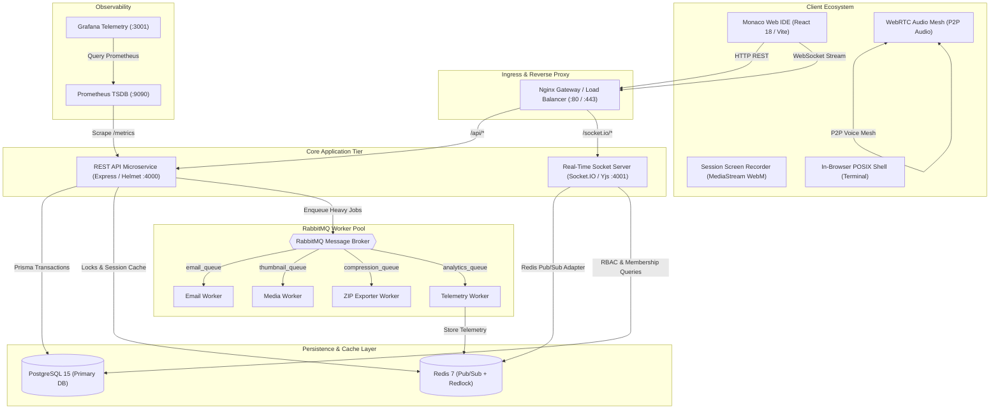
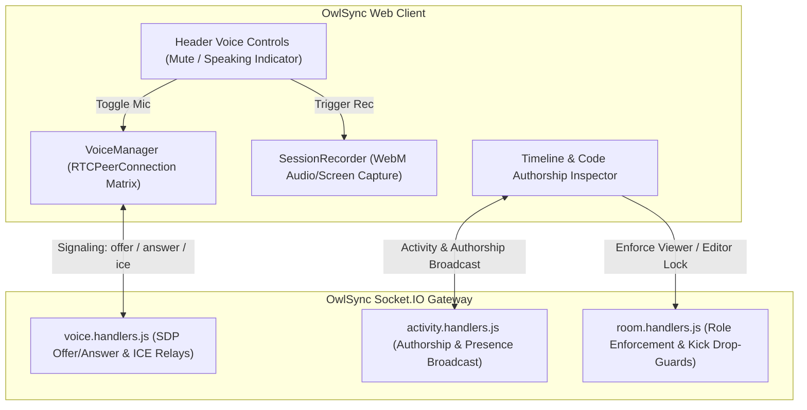
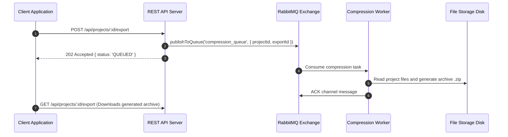

# Software Design Document (SDD)
## OwlSync — Distributed Real-Time Cloud IDE & Collaborative Workspace Architecture

---

### Document Metadata
- **Document Title**: OwlSync System Architecture & Engineering Design Specification
- **Document ID**: SDD-OWLSYNC-2026-V2.4
- **Target Audience**: Principal Engineers, Software Architects, Security Auditors, DevOps Teams
- **Classification**: Production Engineering Reference
- **Version**: 2.4.0 (Stable Release)

---

## 1. Abstract & System Objectives

**OwlSync** is a cloud-native, distributed developer workspace designed for low-latency pair programming, voice communication, synchronous whiteboard drafting, in-browser virtual terminal execution, and context-aware AI assistance.

### 1.1 Core Engineering Goals
1. **Low-Latency Deterministic Synchronization**: Deliver sub-10ms localized keypress rendering and sub-50ms peer-to-peer document convergence using Conflict-Free Replicated Data Types (CRDTs).
2. **High Availability & Fault Isolation**: Decouple stateless REST HTTP handlers from stateful real-time WebSocket connections and background asynchronous worker threads.
3. **Strict Concurrency Guarantees**: Prevent multi-region and multi-instance race conditions using Redis-backed distributed locks (**Redlock Algorithm**) with atomic Lua release scripts.
4. **Resilient Message-Driven Execution**: Utilize **RabbitMQ** for durable message queues, ensuring that intensive media processing, thumbnail rendering, ZIP extraction, and metrics rollups never block the primary event loops.
5. **Turnkey Observability**: Provide native **Prometheus** metrics scraping endpoints and provisioned **Grafana** telemetry dashboards out of the box.

---

## 2. Architectural Paradigm & System Topology

OwlSync is architected as a **Modular Monorepo** with explicit domain boundaries. Each component is independently scalable and deployable across containerized orchestrators.



---

## 3. Real-Time Collaboration & Media Protocols

### 3.1 Document Synchronization & CRDT Mechanics
OwlSync uses **Yjs**—a high-performance CRDT framework with binary encoding. Document states are maintained as a sequence of immutable operations that commute:

$$\text{State}(A) \oplus \Delta B = \text{State}(B) \oplus \Delta A$$

- **Client Editing**: Keypresses in Monaco Editor dispatch binary delta packets (`Uint8Array`) over WebSocket.
- **Server Multiplexing**: The Socket.IO server distributes the update to Redis Pub/Sub channels scoped by `room:{roomId}:editor`.
- **Conflict Resolution**: Concurrently arriving edits converge deterministically across all peers without server-side locking.

### 3.2 WebRTC Peer-to-Peer Voice Mesh Signaling
Voice channels operate over peer-to-peer WebRTC mesh topology coordinated via Socket.IO:



---

## 4. Asynchronous Task Queue Architecture (RabbitMQ)

To ensure sub-5ms HTTP API latency, all CPU-bound, disk-intensive, and network I/O operations are offloaded to **RabbitMQ** durable queues:

| Queue Name | Producers | Consumers | Payload Specifications |
|:---|:---|:---|:---|
| `email_queue` | REST API | Email Worker | `{ to: string, subject: string, text: string, html?: string }` |
| `thumbnail_queue` | REST API / Sockets | Media Worker | `{ recordingId: string, videoPath: string, outputPath: string }` |
| `compression_queue` | Project Service | Compression Worker | `{ projectId: string, exportFileName: string }` |
| `analytics_queue` | Sockets / API | Analytics Worker | `{ userId: string, roomId: string, eventType: string, timestamp: string }` |



---

## 5. Security Architecture & Concurrency Guarantees

### 5.1 Redlock Distributed Locking
To prevent concurrent race conditions across horizontal microservices:
1. **Acquisition**: Atomic `SET lock:{resourceKey} {uniqueToken} NX PX {ttl}`.
2. **Execution**: Safe critical section protected with configurable spin-wait timeout (default: 3000ms).
3. **Atomic Lua Release**:
   ```lua
   if redis.call("get", KEYS[1]) == ARGV[1] then
     return redis.call("del", KEYS[1])
   else
     return 0
   end
   ```

### 5.2 Role-Based Access Control (RBAC) & Drop-Guards
- **Host / Owner**: Full control over room lifecycle, permissions, and member expulsion.
- **Member (Editor)**: Read-write access to Monaco IDE, whiteboards, and terminal execution.
- **Guest (Viewer)**: Read-only access enforced by UI locking and server-side socket drop-guards.

---

## 6. Observability, Metrics & Telemetry

OwlSync integrates native metrics collection through Prometheus and Grafana:

- **Metrics Scrape Endpoint**: `/metrics` (Prometheus exposition format).
- **Tracked Telemetry**:
  - `http_request_duration_seconds` (HTTP latency histogram).
  - `active_websocket_connections_total` (Real-time gauge).
  - `active_rooms_gauge` (Active collaborative session count).
  - `rabbitmq_queue_depth` (Backpressure monitoring).
- **Interactive OpenAPI Documentation**: Swagger UI live at `/api-docs` and `/docs`.
