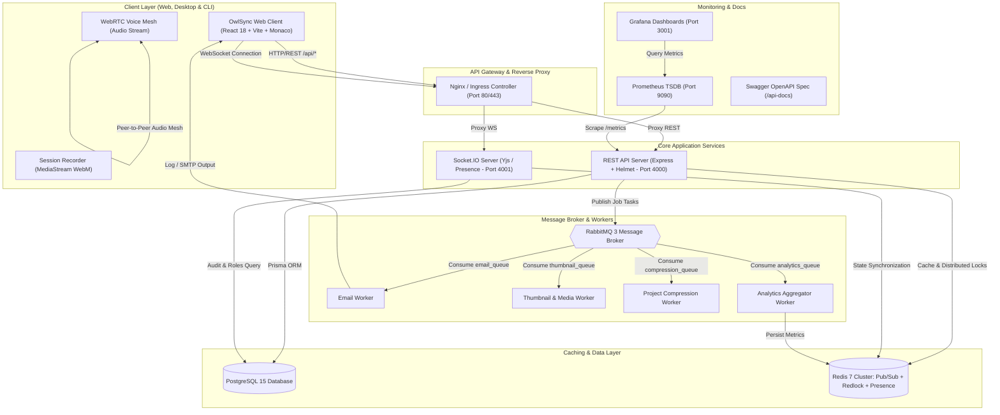
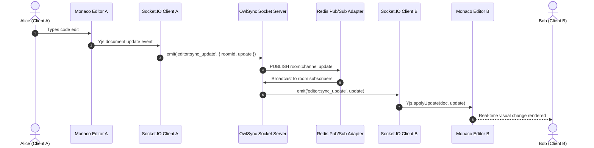
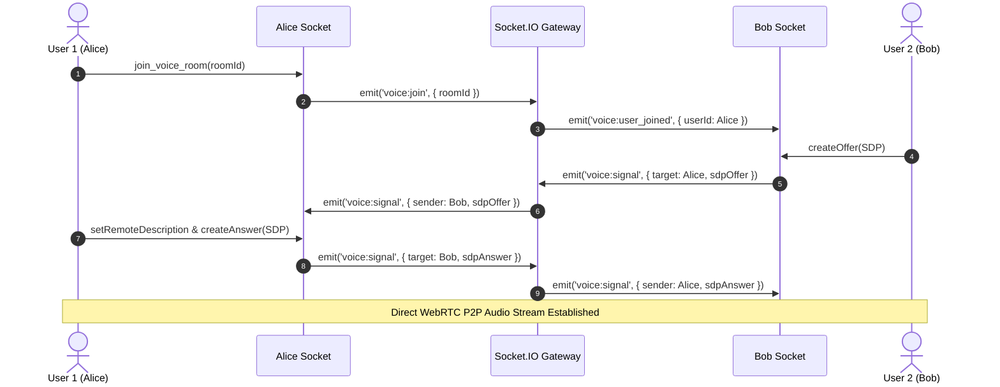
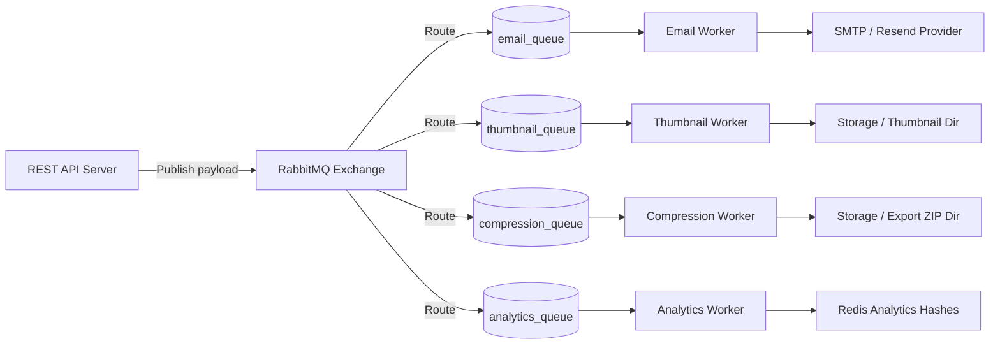

# Software Design Document (SDD)
## OwlSync — Real-Time Developer Collaboration & Cloud Workspace Platform

---

### Document Information
- **Project**: OwlSync (formerly PairForge)
- **Version**: 2.4.0 (Production Release)
- **Architecture Style**: Modular Monorepo (Apps & Packages) with Distributed Microservices
- **Status**: Complete & Production-Ready

---

## 1. Executive Summary & Vision

**OwlSync** is an enterprise-grade developer collaboration platform that converges the core strengths of cloud IDEs (VS Code / Replit), collaborative canvas/documents (Google Docs / Excalidraw), asynchronous communication & presence (Discord / Slack), and AI pair programming (GitHub Copilot / Cursor) into an ultra-low latency, synchronized developer workspace.

### Core Objectives
1. **Zero-Friction Collaboration**: Multiple developers can edit code, speak via WebRTC voice, brainstorm on synchronized whiteboards, and inspect live terminal execution simultaneously.
2. **First-Class Project vs. Room Separation**: Projects represent persistent code assets and file structures, while Rooms represent ephemeral or persistent live sessions inside workspaces.
3. **Resilient Distributed Architecture**: Offload long-running and heavy I/O tasks (email, thumbnail rendering, AI generation, project compression, analytics aggregation) to asynchronous RabbitMQ worker queues, keeping REST API and WebSocket threads at sub-5ms responsiveness.
4. **Comprehensive Observability & Security**: End-to-end distributed locks via Redlock, Prometheus metrics exposition, Grafana observability dashboards, Swagger OpenAPI documentation, and Helmet/CORS security enforcement.

---

## 2. High-Level System Architecture

The following diagram illustrates the complete end-to-end topology across the client layer, API gateway/proxy, real-time WebSocket cluster, asynchronous message queues, persistent storage, and background processing workers:

---

## 3. Real-Time Collaboration & Media Architecture

### 3.1 Collaborative Editor & Yjs CRDT Synchronization
To achieve concurrent collaborative editing without destructive "last-write-wins" conflicts, OwlSync uses Conflict-free Replicated Data Types (CRDTs) powered by **Yjs** with Monaco Editor:

### 3.2 WebRTC Voice Signaling & Audio Mesh Architecture
Voice rooms in OwlSync establish a distributed peer-to-peer mesh coordinated through Socket.IO signaling:

---

## 4. Asynchronous Background Task Pipelines

All intensive operations run out-of-band via RabbitMQ queues to preserve maximum throughput on the main HTTP event loop:

| Queue Name | Producer | Consumer Worker | Responsibility |
|:---|:---|:---|:---|
| `email_queue` | REST API | Email Worker | Handles welcome emails, password reset links, magic login tokens. |
| `thumbnail_queue` | API / Sockets | Thumbnail Worker | Generates lightweight preview thumbnails for recordings. |
| `compression_queue` | Project Service | Compression Worker | Asynchronously creates `.zip` archives of full project codebases. |
| `analytics_queue` | Sockets / API | Analytics Worker | Aggregates room duration, typing velocity, and activity counters into Redis. |

---

## 5. Relational Database Schema & Domain Model

The PostgreSQL database (managed via Prisma ORM) enforces strict referential integrity, cascading cleanup rules, and relational indices:

### Domain Entities Hierarchy
- **Users**: Account credentials, profiles, 2FA configurations, active sessions, badges, and audit trails.
- **Teams & TeamMembers**: Shared organizations with granular roles (`OWNER`, `ADMIN`, `MEMBER`).
- **Projects**: Persistent codebases containing `ProjectFile`, `Note`, `Whiteboard`, and `Activity` history.
- **Rooms & RoomMembers**: Real-time collaborative sessions linked to projects with role-based write permissions (`OWNER`, `MEMBER`, `GUEST`).
- **Friendships & FriendRequests**: Bidirectional social graph with real-time online presence.
- **Notifications**: Persistent in-app activity notifications with deep jump links.
- **Badges & UserBadges**: Milestone-based achievement awards and profile gamification.

---

## 6. Security, Reliability & Concurrency

1. **Distributed Locks (Redlock Algorithm)**:
   - Atomic concurrency locking via Redis `SET NX PX`.
   - Safe release scripts executed via atomic Redis Lua scripts to eliminate race conditions on room creation, joining, and file mutation.
2. **Role-Based Access Control (RBAC)**:
   - Room hosts can change member permissions to `VIEWER` (read-only Monaco editor lock) or kick unauthorized participants.
   - Sockets enforce drop-guards preventing viewer updates from propagating to the collaborative Yjs document.
3. **Session & Security Defense**:
   - HTTP-only encrypted cookies with JWT refresh token rotation.
   - Cross-Site Scripting (XSS) sanitation on Markdown and Code outputs.
   - Helmet HTTP headers (`Content-Security-Policy`, `X-Content-Type-Options`, `Cross-Origin-Resource-Policy`).

---

## 7. Observability & Operational Metrics

- **Prometheus Metrics**: Custom registry exporting active rooms, active WebSocket connections, HTTP latency histograms, and memory footprint on `/metrics`.
- **Grafana Dashboards**: Real-time visualization provisioning for application throughput, connection status, and error rate monitoring.
- **OpenAPI Interactive Documentation**: Complete Swagger UI documentation live at `/api-docs` and `/docs`.
