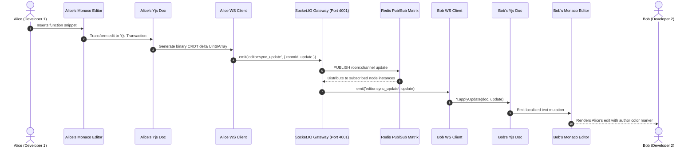
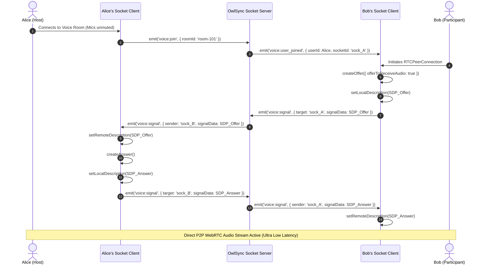
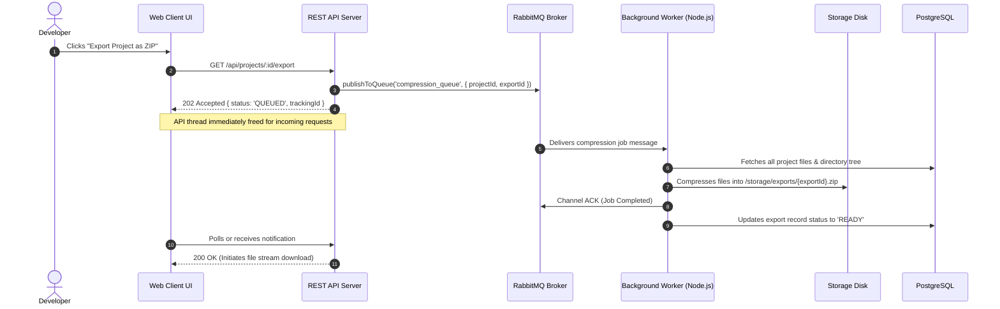
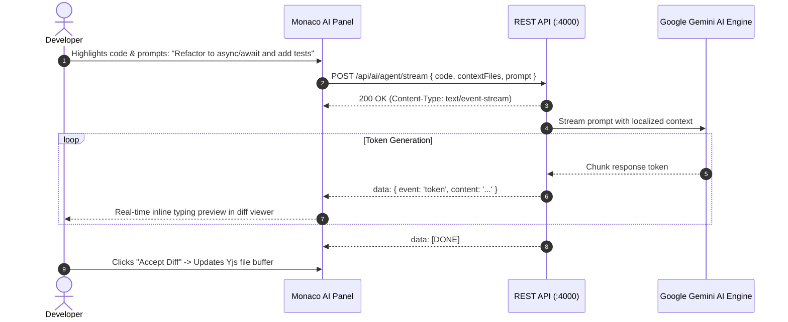
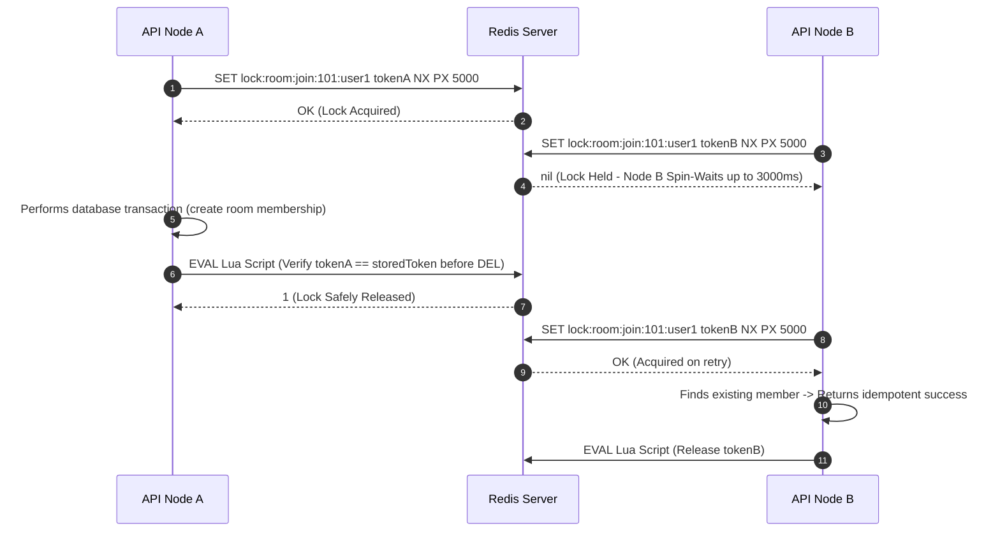

# End-to-End Sequence Diagrams & Interaction Flows
## OwlSync Technical Architecture & Execution Flows

---

## 1. Zero-Conflict Collaborative Code Editing (CRDT Flow)

This diagram details how Monaco Editor keypress events are converted to binary CRDT updates using **Yjs**, propagated through WebSockets, broadcast via Redis Pub/Sub, and applied across remote peer editors without locks or data loss:

---

## 2. WebRTC Peer-to-Peer Voice Mesh Signaling Flow

Voice rooms in OwlSync establish a direct peer-to-peer audio mesh. The Socket.IO server acts exclusively as the SDP and ICE candidate signaling broker:

---

## 3. Asynchronous Task Processing Flow (RabbitMQ Pipeline)

Heavy operations (such as project `.zip` bundle generation or session recording thumbnail processing) are queued asynchronously to keep API response times under 5ms:

---

## 4. Context-Aware AI Pair Programmer (SSE Streaming Flow)

The AI assistant utilizes Server-Sent Events (SSE) to stream intelligent code generation directly into Monaco Editor without blocking HTTP sockets:

---

## 5. Distributed Lock (Redlock Pattern with Atomic Lua Release)

To prevent race conditions during concurrent room joins or workspace updates across horizontal instances:

