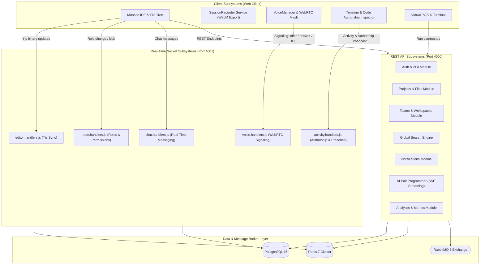
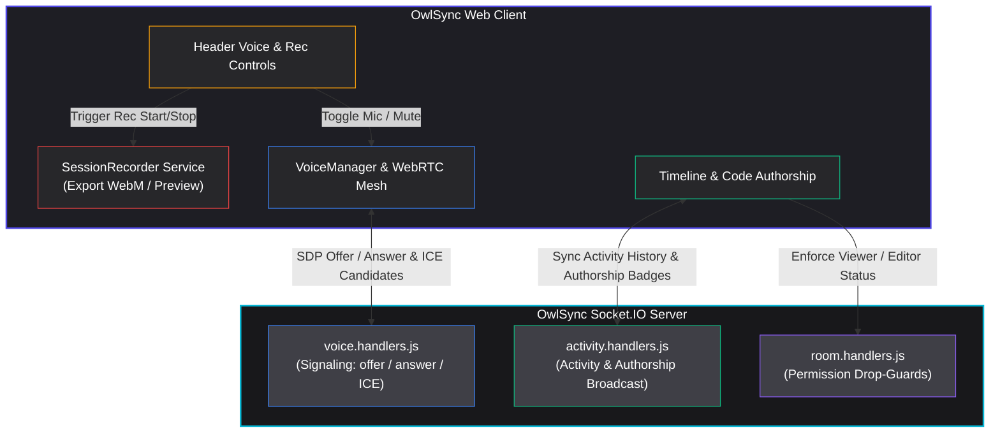
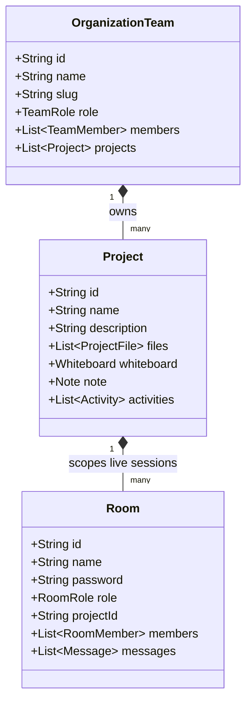

# System Architecture & Component Design
## OwlSync Distributed Architecture Specification

---

## 1. High-Level Subsystem Breakdown

OwlSync is organized into distinct decoupled subsystems spanning the client UI, gateway layer, WebSocket real-time engine, REST API, asynchronous message broker, and persistence storage:

---

## 2. Voice, Media & Authorship Flow Diagram

The diagram below details the client-to-socket event pipeline for WebRTC audio mesh signaling, session screen recording, and live code authorship inspection:

---

## 3. Project vs. Workspace vs. Room Hierarchy

In OwlSync, domain models are cleanly stratified based on lifecycle and purpose:

- **Organization / Team**: Long-lived collaborative tenant owning shared repositories, teams, and members.
- **Project**: Persistent codebase containing file tree, whiteboard canvas, notes, and activity history.
- **Room**: Ephemeral or persistent live session where users co-edit code, speak via WebRTC, and execute scripts in real time.
