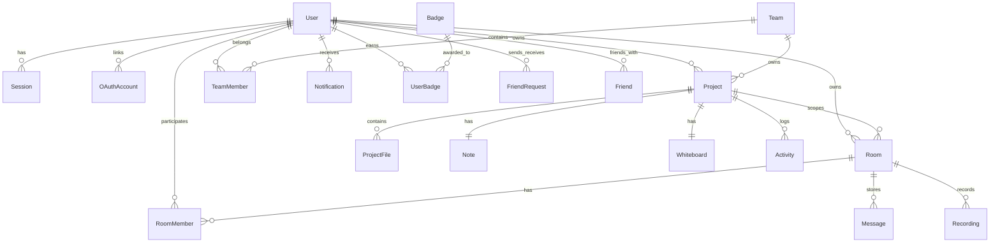

# PostgreSQL Database Schema & Domain Specifications

---

## 1. Schema Overview & Relational Architecture

The OwlSync data store is a **PostgreSQL 15** relational database mapped via **Prisma ORM**. It features full cascade deletions, foreign key referential integrity, and composite uniqueness constraints.

---

## 2. Core Tables Summary

### `User`
- Primary account entity storing credentials, names, usernames, avatars, 2FA secret/status, and presence state.

### `Team` & `TeamMember`
- Multi-tenant organization grouping developers with assigned roles (`OWNER`, `ADMIN`, `MEMBER`).

### `Project` & `ProjectFile`
- Project repositories containing multi-file directory paths, notes, whiteboard snapshots, and timeline audit logs.

### `Room` & `RoomMember`
- Real-time collaboration rooms with security passwords and active member roles (`OWNER`, `MEMBER`, `GUEST`).

### `Notification`
- Persistent alert ledger storing notifications (`SYSTEM`, `ROOM_INVITE`, `FRIEND_REQUEST`, `MENTION`) with navigation deep links.

### `Badge` & `UserBadge`
- Achievement gamification catalog storing criteria, icons, and timestamped user unlocks.
