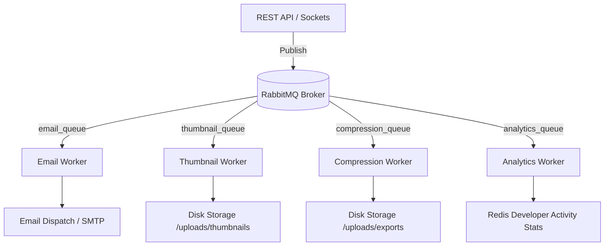

# Background Processing & RabbitMQ Worker Architecture

---

## 1. Overview
The `@owlsync/workers` package consumes asynchronous job messages published by the API server and WebSocket server across durable RabbitMQ queues.



---

## 2. Queue Catalogs & Payloads

### 1. `email_queue`
- **Purpose**: Asynchronously send transactional emails, password resets, and magic login links.
- **Payload Schema**:
  ```json
  {
    "to": "user@example.com",
    "subject": "Sign in to OwlSync",
    "text": "Click here to login: https://owlsync.dev/auth/magic-link?token=..."
  }
  ```

### 2. `thumbnail_queue`
- **Purpose**: Generates video preview thumbnails for IDE session screen recordings.
- **Payload Schema**:
  ```json
  {
    "recordingId": "rec-12345",
    "videoPath": "storage/recordings/session.webm",
    "outputPath": "storage/thumbnails/rec-12345.jpg"
  }
  ```

### 3. `compression_queue`
- **Purpose**: Generates downloadable `.zip` bundles of user or team projects without locking HTTP event loops.
- **Payload Schema**:
  ```json
  {
    "projectId": "proj-9876",
    "exportFileName": "project-export-172500000.zip"
  }
  ```

### 4. `analytics_queue`
- **Purpose**: Aggregates developer statistics, typing cadence, coding duration, and session metrics.
- **Payload Schema**:
  ```json
  {
    "userId": "user-uuid",
    "roomId": "room-uuid",
    "eventType": "CODE_EDIT",
    "timestamp": "2026-09-11T12:00:00Z"
  }
  ```
